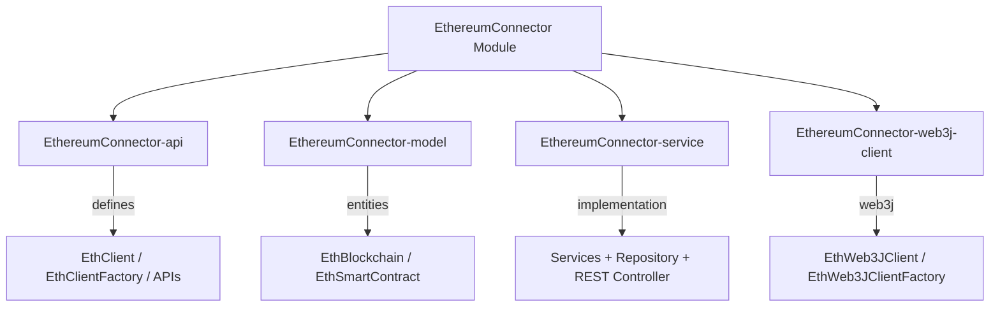

# EthereumConnector Module

The **EthereumConnector** module provides Ethereum blockchain integration for the Water Framework. It abstracts blockchain interactions through a standardized API, supporting multiple Ethereum networks, smart contract management, and transaction handling via the Web3J library.

## Architecture Overview



## Sub-modules

| Sub-module | Description |
|---|---|
| **EthereumConnector-api** | Core interfaces: `EthClient`, `EthClientFactory`, `BlockchainApi`, `SmartContractApi`, REST APIs |
| **EthereumConnector-model** | JPA entities: `EthBlockchain` (network config), `EthSmartContract` (contract metadata) |
| **EthereumConnector-service** | Service implementations, repositories, and REST controllers |
| **EthereumConnector-web3j-client** | Web3J-based implementation of `EthClient` and `EthClientFactory` |

## Entities

### EthBlockchain

Represents a blockchain network configuration:

| Field | Type | Constraints | Description |
|---|---|---|---|
| `protocol` | String | `@NotNull` | Network protocol (http, https, ws, wss) |
| `host` | String | `@NotNull`, unique (composite) | Node hostname/IP |
| `port` | String | `@NotNull`, unique (composite) | Node port |

### EthSmartContract

Represents a deployed smart contract:

| Field | Type | Constraints | Description |
|---|---|---|---|
| `name` | String | `@NotNull`, unique | Contract name |
| `contractClass` | String | `@NotNull` | Java contract wrapper class |
| `address` | String | `@NotNull`, unique | On-chain contract address |
| `blockchain` | EthBlockchain | `@ManyToOne` | Associated blockchain network |

## Default Roles

**EthBlockchain:**
| Role | Permissions |
|---|---|
| **ethBlockChainManager** | `save`, `update`, `find`, `find_all`, `remove` |
| **ethBlockChainViewer** | `find`, `find_all` |
| **ethBlockChainEditor** | `save`, `update`, `find`, `find_all` |

**EthSmartContract:**
| Role | Permissions |
|---|---|
| **ethereumSmartContractManager** | `save`, `update`, `find`, `find_all`, `remove` |
| **ethereumSmartContractViewer** | `find`, `find_all` |
| **ethereumSmartContractEditor** | `save`, `update`, `find`, `find_all` |

## EthClient Interface

The `EthClient` interface abstracts all blockchain operations:

| Method | Description |
|---|---|
| `listAccounts()` | List accounts on the node |
| `getBalanceOf(String address)` | Get ETH balance |
| `sendEther(String to, BigDecimal amount)` | Transfer ETH |
| `setCredentials(String privateKey)` | Set credentials from private key |
| `setCredentials(String username, String password, String walletPath)` | Set credentials from wallet |

## REST Endpoints

**Blockchains:**
| HTTP Method | Path | Description |
|---|---|---|
| `POST` | `/water/ethereum/blockchains` | Create blockchain config |
| `PUT` | `/water/ethereum/blockchains` | Update blockchain config |
| `GET` | `/water/ethereum/blockchains/{id}` | Find by ID |
| `GET` | `/water/ethereum/blockchains` | Find all |
| `DELETE` | `/water/ethereum/blockchains/{id}` | Remove |

**Smart Contracts:**
| HTTP Method | Path | Description |
|---|---|---|
| `POST` | `/water/ethereum/smart-contracts` | Create smart contract |
| `PUT` | `/water/ethereum/smart-contracts` | Update smart contract |
| `GET` | `/water/ethereum/smart-contracts/{id}` | Find by ID |
| `GET` | `/water/ethereum/smart-contracts` | Find all |
| `DELETE` | `/water/ethereum/smart-contracts/{id}` | Remove |

## Usage Example

```java
// Get the client factory
@Inject
private EthClientFactory ethereumClientFactory;

// Create blockchain config and build client
EthBlockchain blockchain = new EthBlockchain("http", "localhost", "8545");
EthClient client = ethereumClientFactory
    .withEthereumBlockChain(blockchain)
    .build();

// Set credentials
client.setCredentials("your-private-key");

// Perform operations
List<String> accounts = client.listAccounts();
BigInteger balance = client.getBalanceOf("0x...");
client.sendEther("0x...", BigDecimal.valueOf(1.0));
```

### Smart Contract Interaction

```java
// Get Web3J client for low-level contract operations
EthWeb3JClient web3jClient = (EthWeb3JClient) client;
Web3j web3j = web3jClient.getWeb3j();
TransactionManager txManager = web3jClient.createNewTransactionManager(chainId);
ContractGasProvider gasProvider = web3jClient.createContractGasProvider(gasPrice, gasLimit, null, null);

// Load and interact with contract
MyContract contract = MyContract.load(contractAddress, web3j, txManager, gasProvider);
```

## Configuration

| Property | Description |
|---|---|
| `clientFactoryType` | Client factory type (default: `Web3J`) |
| `ethereum-persistence-unit` | JPA persistence unit for blockchain entities |

### Gas Configuration

| Property | Description |
|---|---|
| `gasPrice` | Default gas price in Wei |
| `gasLimit` | Default gas limit |
| `functionsGasPrice` | Per-function gas price overrides |
| `functionsGasLimit` | Per-function gas limit overrides |

## Importing the Module

```gradle
dependencies {
    implementation 'it.water.connectors.ethereum:EthereumConnector-api:${waterVersion}'
    implementation 'it.water.connectors.ethereum:EthereumConnector-model:${waterVersion}'
    implementation 'it.water.connectors.ethereum:EthereumConnector-service:${waterVersion}'
    implementation 'it.water.connectors.ethereum:EthereumConnector-web3j-client:${waterVersion}'
}
```

## Dependencies

- **Core-api** — Base interfaces and component registration
- **Core-security** — `@AccessControl`, `@DefaultRoleAccess`
- **Repository / JpaRepository** — Persistence layer
- **Rest** — REST controller infrastructure
- **Web3J 4.12.2** — Ethereum client library
